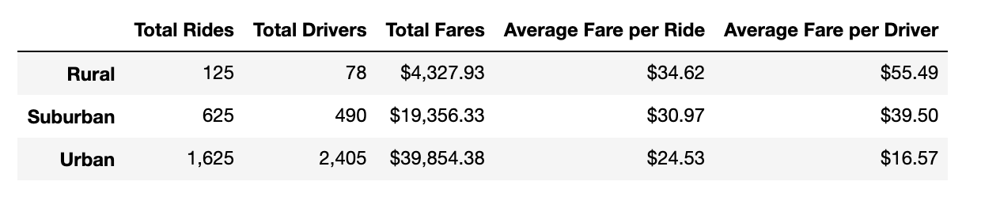
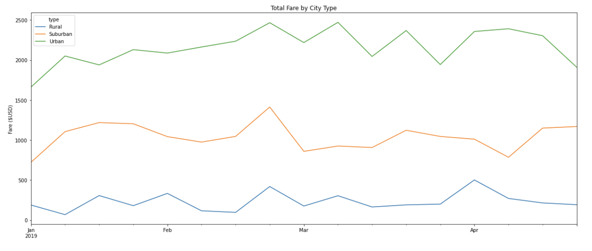

# PyBer_Analysis

## Overview of PyBer Analysis

Our boss, V. Isualize, has given us a new assignment at PyBer. First, we need to use Pandas and Python to create a summary DataFrame of the ride-sharing data by city type. We then need to create a multiple-line graph that shows the total weekly fares for each city type.

### Purpose

The purpose of this analysis is to create a DataFrame showing the ride-sharing data by city type, and a line graph that shows the total weekly fares for each city type. We will compare the differences between the three city types.

## PyBer Analysis Results

### Summary DataFrame Analysis

We made a DataFrame that shows the total rides, total drivers, total fares, average fare per ride, and average fare per driver for each of the three city types (urban, suburban, and rural). From this DataFrame, we can see that the city type with the most total rides and total drivers was urban, with 1,625 total rides and 2,405 total drivers. Rural city types had the least amount with 125 total rides, and 78 total drivers. Suburban was in the middle with 625 total rides and 490 total drivers. Since urban cities had the most amount of rides, they also had the most total fares with $39,854.38. Rural had $4,327.93 total fares, and suburban cities had $19,356.33. The average fares per ride and average fares per driver were highest in rural areas, and lowest in urban areas. The average fare per ride for rural areas was $34.62, $30.97 for suburban areas, and $24.53 for urban cities. The average fare per driver for rural cities was $55.49, $39.50 for suburban, and $16.57 for urban. This data can be seen in the DataFrame image below.

### Multiple-line Chart Analysis

We made a multiple-line chart to show the total fare by city type over four months in 2019. Based on this chart (displayed below) we can see that the urban cities had the highest total fares. The green line in the image represents urban cities, orange is suburban, and blue is rural. The green line (urban cities), is a lot higher than the fares for suburban and rural cities.

## PyBer Analysis Summary

Based on our research and analysis, we have some recommendations to present to the PyBer CEO to address disparities among the three city types. We want suburban and rural cities to have a higher total fare, like we see from the urban cities. 
The first idea to address disparities in rural areas is to increase the average fare per ride, because the total rides probably won't increase much for a small area, and therefore we should take a little more money per ride. We might have less total rides, but make more off of less rides. We should also increase the average total fares per ride to increase total fares in suburban cities because there are more rides than drivers. However in urban cities, we can see that there are more drivers than there are rides, so we should decrease the fare to increase the number of rides taken.

